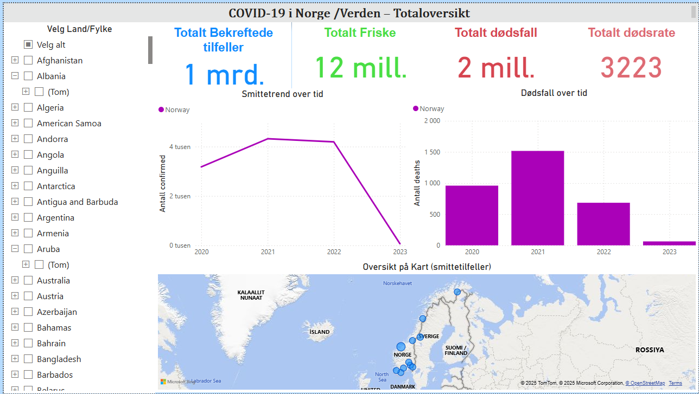
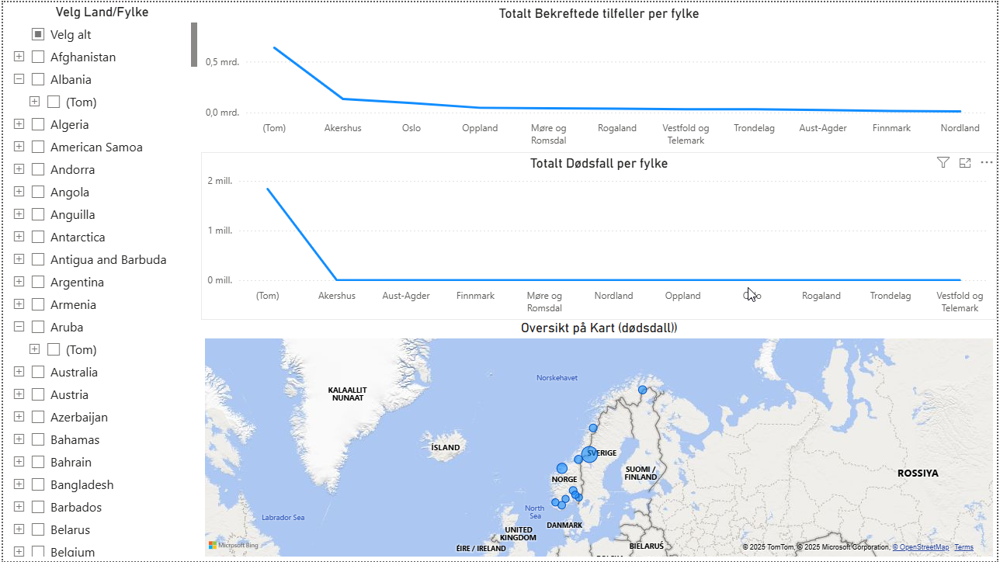
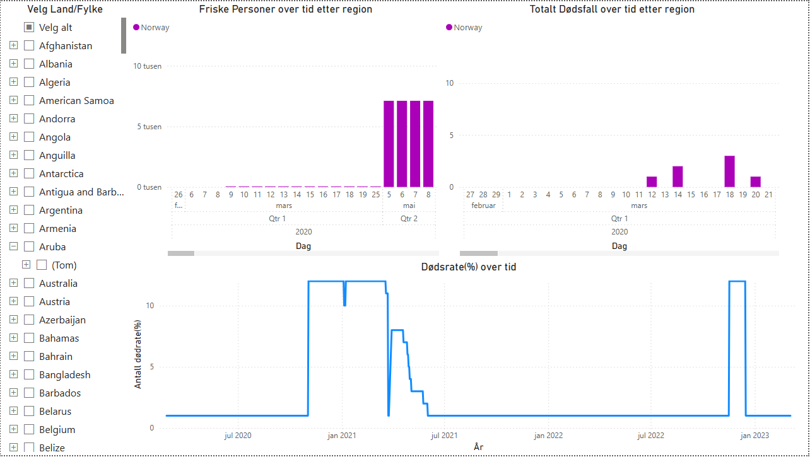

# 🦠 COVID-19 Data Pipeline – AWS + Python + Power BI

Dette prosjektet demonstrerer en komplett datapipeline for COVID-19-data: fra API til sky, til interaktive visualiseringer i Power BI – med et spesielt fokus på Norge.

---

## 📌 Formål

- Hente oppdatert COVID-19-data via API
- Transformere og lagre data som Parquet på AWS S3
- Bygge Glue-baserte tabeller og spørre data med Athena
- Visualisere utviklingen i Power BI med kart og filtre

---

## 🏗️ Arkitektur

```
API → Python → Parquet → Amazon S3 → AWS Glue → Amazon Athena → Power BI
```

| Komponent     | Teknologi             | Funksjon |
|---------------|------------------------|----------|
| Datakilde     | [covid-api.com](https://covid-api.com) | Daglige smittedata |
| ETL-skript     | Python (`CovidDataLake.py`) | Henter, behandler og lagrer data |
| Lagring       | Amazon S3             | Datagrunnlag i Parquet-format |
| Katalog       | AWS Glue              | Oppretter tabeller fra S3-data |
| Analyse       | Amazon Athena         | SQL på data i S3 |
| Visualisering | Power BI              | Interaktiv rapportering og KPI-er |

---

## 💻 Teknologier brukt

- Python 3.10+
- pandas, requests, boto3, pyarrow
- AWS S3, Glue, Athena
- Power BI Desktop
- Amazon Athena ODBC-driver

---

## 📊 Power BI-rapport – Innhold

Rapporten består av 3 interaktive sider:

| Side                 | Innhold                                     |
|----------------------|---------------------------------------------|
| `COVID-19 Oversikt`  | KPI-tall, smittetrend, dødsfall per år      |
| `Fylkesvis Analyse`  | Kart og stolpediagrammer per fylke          |
| `Utvikling Over Tid` | Daglige endringer i smitte og friske        |

**Slicere:** Land, Fylke, Dato

---

## 📁 Mappestruktur

```
.
├── data/
├── visuals/
│   ├── visual1.png
│   ├── visual2.png
│   └── visual3.png
├── CovidDataLake.py
├── LICENSE
├── requirements.txt
└── README.md
```

---

## 📤 Power BI-rapportfil

⚠️ `.pbix`-filen er ikke lastet opp direkte i repoet (130 MB > GitHubs 100 MB-grense).

📎 Du kan laste ned Power BI-rapporten her:  
🔗 [Last ned CovidDashboard.pbix fra Google Drive](https://drive.google.com/file/d/1W3mydYUjPIzfFhj7hl0fo3b2gdwucNN6/view?usp=sharing)

📸 Nedenfor finner du forhåndsvisninger av dashboardet:

### Visual 1 – Oversikt og KPI-er


### Visual 2 – Fylkesvis Analyse


### Visual 3 – Tidsserieutvikling


---

## ▶️ Kom i gang

### 1. Klon repoet
```bash
git clone https://github.com/SushantSriv/COVID-19-Data-Pipeline-AWS-Python-Power-BI.git
cd COVID-19-Data-Pipeline-AWS-Python-Power-BI
```

### 2. Installer Python-avhengigheter
```bash
pip install -r requirements.txt
```

### 3. Kjør datainnhenting
```bash
python CovidDataLake.py
```

Dette henter COVID-data for Norge og laster opp `.parquet` til S3.

---
## 📄 Lisens

Lisensiert under [MIT License](LICENSE).
